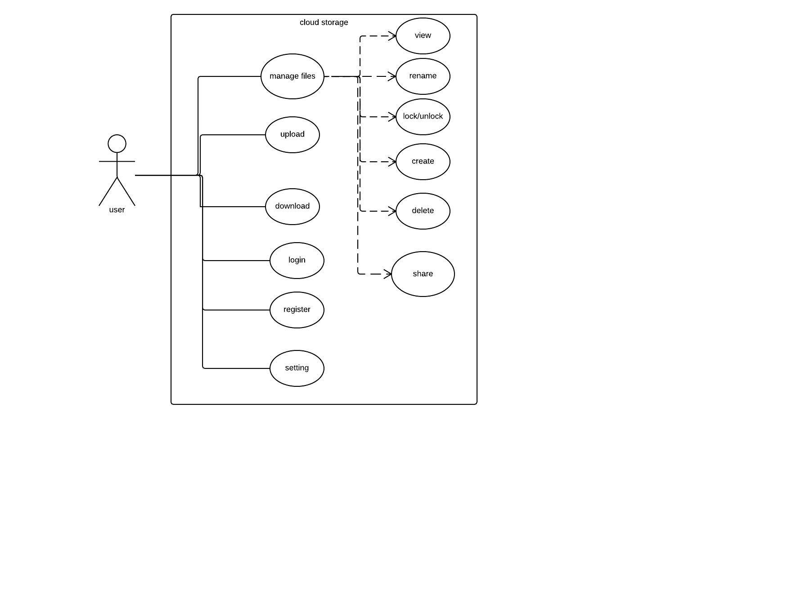

# cloudstorage
A website for cloud file management
## Use Case

## Deployment
### step1 Clone
`git clone git@github.com:songhm3/cloudstorage.git cloudstorage`

`cd cloudstorage`

`jar -cvf cloudstorage.war *`
### step2 Deploy 
`sudo cp ~/cloudstorage.war /path/to/your/tomcat/webapps/`

Now you can verify the server on your browser: http://localhost:8080/cloudstorage/
